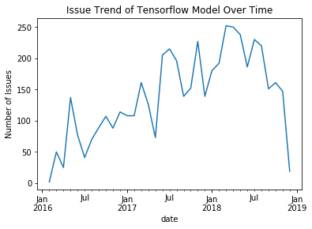
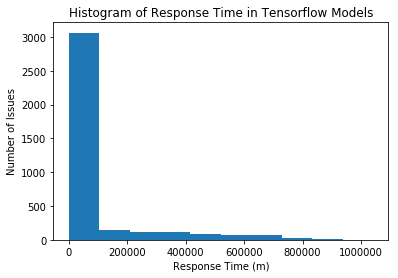
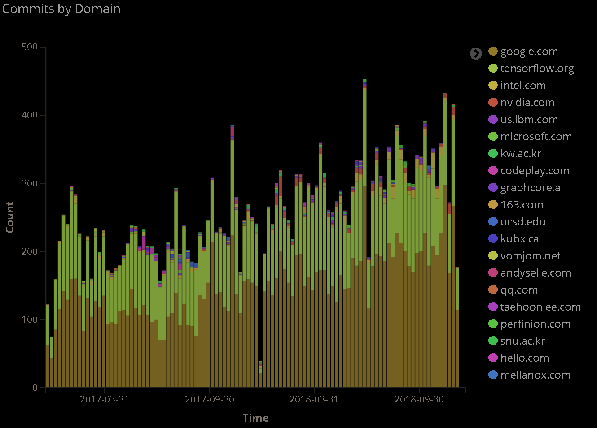
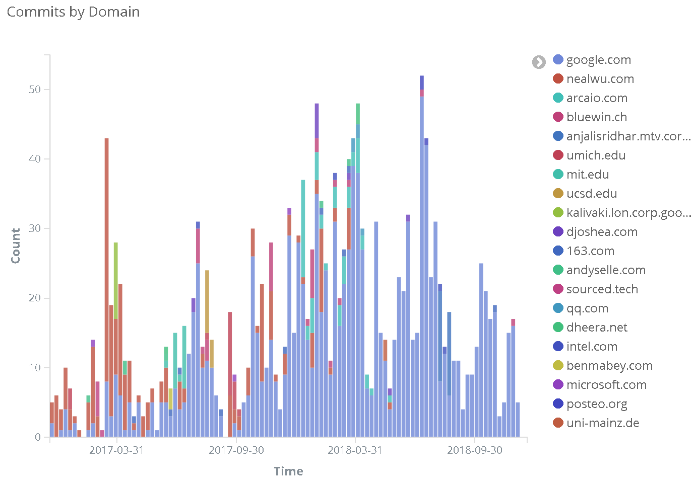
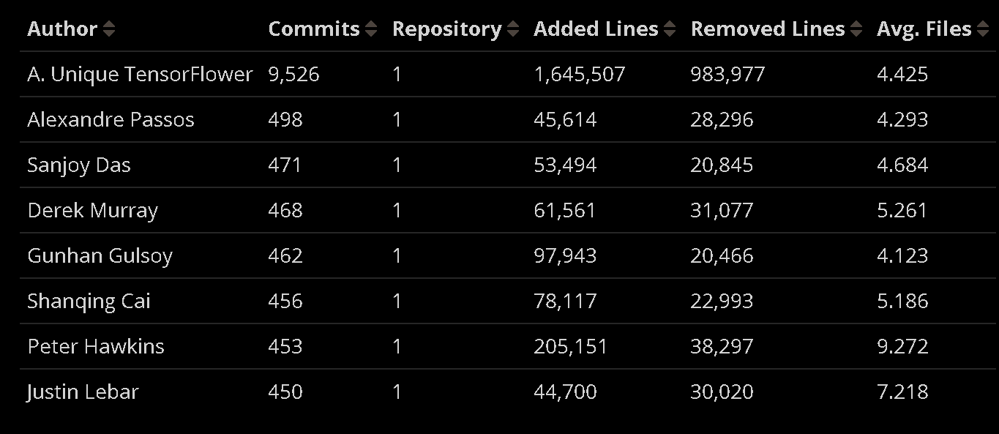
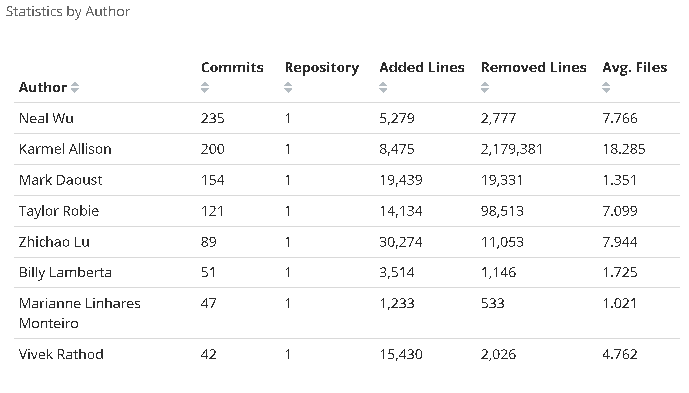
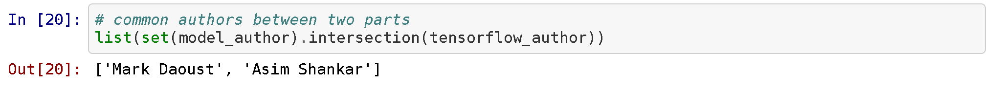

---?image=template/img/portada.png&position=center&size=100% 100%
### @color[white](Getting Inspired! Understanding How and Why Examples are Used in Creative Design Practice)
##### @color[white](December 20th 2018)

&nbsp;

#### @color[white](Scarlett R. Herring, Chia-Chen Chang, Jesse Krantzler, and Brian P. Bailey)

---?color=black
@title[Motivation]

@snap[north-west text-white]
# Motivation
@snapend

@snap[south-west list-content-concise span-100 text-white ]
@ol
- Machine Learning Frameworks and community is in constant evolution
- Lack of research in studying the Artificial Intelligence Models phenomena
- Companies creating models store as a service like modeldepot or Amazon.

@olend
  
@snapend
---?image=template/img/cityscape.png&position=bottom&size=100% 60%

@snap[north span-65]
@box[bg-blue text-white rounded](Previous Work#The Open-Closed Principle of Modern Machine Learning.)
@snapend

@snap[midpoint template-note text-gray]
 B. A. Houssem Ben Braiek, Foutse Khomh, The Open-Closed Principle of Modern Machine Learning. In MSR ’18: MSR ’18: 15th International Conference on Mining Software Repositories , May 28–29, 2018
@snapend

---?color=black

@snap[west span-45]
## Research Questions
@snapend

@snap[north-east span-60 fragment]
@box[bg-purple text-white](RQ 1.#How the response for issues has evolved over the time for the Models?)
@snapend

@snap[east span-60 fragment]
@box[bg-orange text-white](RQ 2.#Are the same organizations the same contributing to the models and Framework?)
@snapend

@snap[south-east span-60 fragment]
@box[bg-pink text-white](RQ 3.#Are the same authors developing the framework the ones who develop the Models?)
@snapend

---?image=template/img/headphones.jpg
@title[Covered Background]

@snap[west text-black span-15]
**@size[1.2em](Methodology.)**
@snapend

---?image=template/img/bg/pink.jpg&position=left&size=30% 50%
@title[sidebox + text body]

@snap[west text-white]
@size[3em](RQ1.)
@snapend

@snap[east span-70]
Taking in account the date and number of issues: @css[text-pink](Issues Trend over time in Models).
@snapend

---?image=template/img/bg/pink.jpg&position=left&size=30% 50%
@title[sidebox + text body]

@snap[west text-white]
@size[3em](RQ1.)
@snapend

@snap[center span-170]
&nbsp;

@snapend

---?image=template/img/bg/pink.jpg&position=left&size=30% 50%
@title[sidebox + text body]

@snap[west text-white]
@size[3em](RQ1.)
@snapend

@snap[center span-170]
&nbsp;

@snapend
---?image=template/img/bg/black.jpg&position=right&size=50% 100%
@title[Text + Image]

@snap[east span-40 text-11 text-white]
**RQ1**
Must of the issues had been closed.
@snapend

@snap[west]
@img[split-screen-img span-100](template/img/graph2.png)
@snapend

---?color=linear-gradient(120deg, #f6d365 0%, #fda085 100%);

@box[bg-orange text-white demo-box-text-padding rounded](Are the same organizations the same contributing to the models and Framework?)

---?image=template/img/bg/black.jpg&position=right&size=50% 100%
@title[Text + Image]

@snap[north-east text-11 text-white]
**Tensorflow Framework**
@snapend

@snap[south-east span-40 text-08 text-white]
Commits: 27191, Authors: 780
@snapend

@snap[east span-40 text-11 text-white]
@img[split-screen-img span-100](template/img/pie1t.png)
@snapend

@snap[north-west text-11]
**Tensorflow Models**
@snapend

@snap[south-west span-40 text-08]
Commits: 1785, Authors: 198
@snapend

@snap[west span-40]
@img[split-screen-img span-100](template/img/pie2m.png)
@snapend

@snap[south-west template-note text-gray]
Are the same organizations the same contributing to the models and Framework?
@snapend

---?image=template/img/bg/black.jpg&position=right&size=50% 100%
@title[Text + Image]

@snap[north-east text-11 text-white]
**Tensorflow Framework**
@snapend

@snap[east span-50 text-11 text-white]

@snapend

@snap[north-west text-11]
**Tensorflow Models**
@snapend

@snap[west span-50]

@snapend

---?color=linear-gradient(120deg, #f6d365 0%, #fda085 100%);

@box[bg-orange text-white demo-box-text-padding rounded](Are the same authors developing the framework the ones who develop the Models?)

---?image=template/img/bg/black.jpg&position=right&size=50% 100%
@title[Text + Image]

@snap[north-east text-11 text-white]
**Tensorflow Framework**
@snapend

@snap[east span-50 text-11 text-white]

@snapend

@snap[north-west text-11]
**Tensorflow Models**
@snapend

@snap[west span-50]

@snapend

---?image=template/img/bg/orange.jpg&position=top&size=100% 20%
@title[Header Bar + Image Body]

@snap[north text-white span-100]
@size[1.5em](RQ3 - True just for 2 authors)
@snapend

@snap[center span-100]

  
@snapend

---?color=black
@title[Motivation]

@snap[north-west text-white]
## Threats to Validity
@snapend

@snap[center list-content-concise span-100 text-white ]
@ol
- Different authors may post as "A. Unique Tensorflower".
- Precision and Recall of perceval for mining.

@olend
  
@snapend

---?color=black
## Future Work
@snapend

@snap[center list-content-concise span-100 text-white ]
@ol
- Distinguish between research and official models. 
- Compare with other models.
- Activities related to the models
- Study dependencies
- Size of the Models
@olend
  
@snapend

---?image=template/img/conclusion2.png&size=100% 100%
@title[Header Bar + Image Body]
